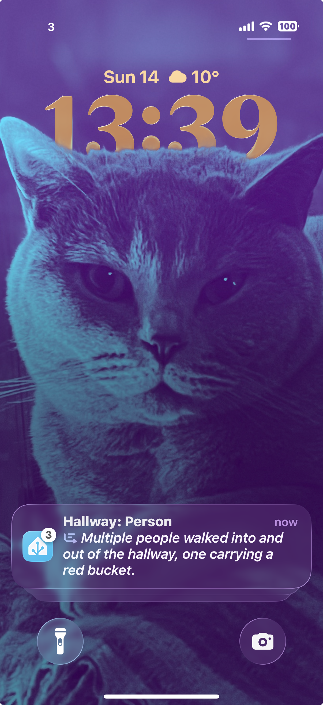

# AI-Described Security Clips to Your Phone — In 80 Lines

Frigate detects objects, LLM describes the scene, and you get a video clip notification on your phone.

## What You Get



A notification with the AI description and a thumbnail. Tap to view the clip.

> **Hallway: Cat**
> A tabby cat walks across the hallway toward the camera.
> *[Tap to view clip]*

<br clear="right">

## What This Repo Contains

1. **Frigate Docker setup** — config files and docker-compose for running Frigate NVR
2. **Home Assistant automation** — ~80 lines of YAML that ties it all together

## Why This Exists

I struggled to understand and get working the [500+ line Blueprint](https://community.home-assistant.io/t/blueprint-frigate-vision-ai-powered-notifications-with-llm-recognition-cooldowns-multi-cam-logic-v0-9/907582/13) and its [1000+ line derivatives](https://community.home-assistant.io/t/frigate-ai-notification-multi-camera-include-exclude-zones-llmvision-low-noise/937467). So, I reverse engineered it back to an ~80 line Home Assistant automation: specify a camera, specify detection events (person, cat), get an AI summary, send a notification to iOS with the video clip. That's it.

## Prerequisites

- **Docker host** — NAS, server, Raspberry Pi, etc.
- **Home Assistant** — with [HACS](https://hacs.xyz/) installed
- **Cameras** — any Frigate-compatible cameras (tested with Reolink via NVR)
- **MQTT broker** — usually Mosquitto add-on in Home Assistant
- **LLM API key** — Google Gemini, OpenAI, or other provider supported by LLM Vision

## Part 1: Frigate Setup

### 1.1 Configure

```bash
cp .env.example .env
cp docker-compose.frigate.example.yml docker-compose.frigate.yml
cp config/config.example.yml config/config.yml
# Edit each file with your values (IPs, passwords, camera paths)
```

### 1.2 Deploy

```bash
# Copy files to your Docker host
ssh your-user@your-nas.local "mkdir -p /volume1/docker/frigate/config"
scp -r .env docker-compose.frigate.yml config/ your-user@your-nas.local:/volume1/docker/frigate/
```

### 1.3 Start Frigate

```bash
cd /volume1/docker/frigate
docker compose up -d
```

### 1.4 Verify

- Frigate UI: `http://your-nas-ip:5000`
- Check cameras are streaming and detection is working

### Compatibility

The Frigate Docker setup should work on any Docker host, but developed and tested specifically on Ugreen NAS DXP4800+ (see [UGOS Setup Notes](docs/UGOS-SETUP.md) for NAS-specific quirks).

## Part 2: Home Assistant Automation

### 2.1 Install LLM Vision

1. Install [LLM Vision](https://github.com/valentinfrlch/ha-llmvision) via HACS
2. Configure your AI provider (e.g., Google Gemini API key)
3. Note down the provider ID (you'll need it for the automation)

### 2.2 Copy the Automation

```bash
cp config/automations.example/hallway-cat-detection.yaml config/automations/
```

Edit the file and update:
- `camera` — your camera name in Frigate
- `label` — detection types (person, cat, dog, car)
- `provider` — your LLM Vision provider ID
- `notify.mobile_app_xxx` — your mobile app notify service

### 2.3 Import into Home Assistant

Settings → Automations → Create → Edit as YAML → Paste contents → Save

### How It Works

```
Cameras/NVR (RTSP)
    ↓
Frigate (local object detection)
    ↓ MQTT event: "person detected"
Home Assistant
    ↓ triggers automation
LLM Vision (analyzes 3 frames from clip)
    ↓
Notification (LLM description + clip link)
```

Frigate runs object detection locally (no cloud). When it detects something (person, cat, etc.), Home Assistant triggers the automation which sends 3 frames from the recorded clip to an LLM for a text description. You get a notification with the description + a link to the clip.

## Customization

### Android Notifications

Change the notify service from `notify.mobile_app_xxx_iphone` to your Android device:

```yaml
- action: notify.mobile_app_your_android_phone
```

The `url` and `clickAction` fields work the same way.

### Non-Reolink Cameras

Update the RTSP paths in `config/config.yml` to match your camera's stream URLs. See [Frigate camera docs](https://docs.frigate.video/configuration/camera_specific) for common formats.

### Other LLM Providers

This example uses Google Gemini, but LLM Vision supports OpenAI, Anthropic Claude, and local models (Ollama, LocalAI).

1. In Home Assistant, go to Settings → Devices & Services → LLM Vision
2. Add your provider and note its ID (shown in the integration)
3. Update the automation's `provider` field with your provider ID

The `model` field also needs updating for non-Gemini providers:
```yaml
provider: YOUR_PROVIDER_ID
model: gpt-4o          # OpenAI
model: claude-sonnet-4-20250514   # Anthropic
model: llava           # Ollama local
```

### Multiple Cameras

Duplicate the automation file for each camera, or modify the trigger condition to match multiple cameras:

```yaml
value_template: >-
  {{ trigger.payload_json.after.camera in ['hallway', 'front_door', 'garage'] }}
```

## Management

```bash
docker logs frigate -f              # View logs
docker compose restart frigate      # Restart
docker compose pull && docker compose up -d  # Update
```

## Troubleshooting

### Key URLs

- **Frigate UI**: http://your-nas-ip:5000
- **RTSP Restream**: rtsp://your-nas-ip:8554/{camera_name}
- **Home Assistant**: http://homeassistant.local:8123

### Environment Variables

Frigate only recognizes env vars prefixed with `FRIGATE_`. Use `FRIGATE_NVR_IP`, not `REOLINK_NVR_IP`.

### Security

Frigate web UI has no authentication. It's only accessible on LAN via port 5000. Do not expose to internet without adding auth via Traefik or similar.

## Documentation

- [UGOS Setup Notes](docs/UGOS-SETUP.md) — NAS-specific configuration
- [Reolink Camera Guide](docs/REOLINK-CAMERAS.md) — Reolink-specific stream configuration
- [Frigate Docs](https://docs.frigate.video/) — Official documentation

## Contributing

Issues and pull requests welcome at [GitHub](https://github.com/Pharkie/frigate-ugreennas).
